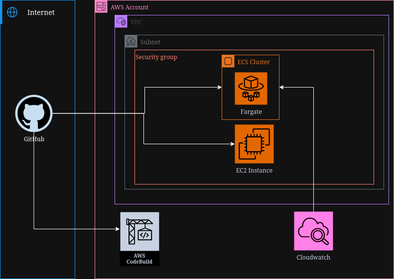

# AWS Wordpress ECS deployment with CDKTF
## Architecture

## Instructions
### This deployment requires the use of user Access Keys.
To deploy using deploy using Terraform Cloud, uncomment lines 10, 109-116 in main.ts and comment out line 104.

Comment out Config credentials in .github/workflows/deployment-workflow.yml

Add CDKTF_ECS_TFC_ORGANIZATION to the env block of CDKTF Deployment in .github/workflow/deployment-workflow.yml with the name of your organizatoin as the value.
### In the secrets and variables Actions menu, place the following key pairs
    1. AWS_ACCOUNT: <AWS_ACCOUNT>
    2. AWS_ROLE: <AWS_ROLE>
    5. VPC_ID: <id_of_vpc>
    6. STATE_BUCKET: <backend_bucket_to_store_state>
    7. SUBNET: <first_subnet>
    8. SUBNET_2: <second_subnet>
    8. GH_TOKEN: <Personal Access Token>

### Deploy ECS Application:
The ecs runner requires a custom image with the GitHub registration script already copied to the image.

If that is lacking an ECS deployment workflow is available for creating and deploying an image to an AWS ECR. 

The workflow is designed to run on an AWS codebuild instance. Follow the above instructions to first deploy an Codebuild instance before deploying the ECS build deployment workflow.
    1. Navigate to the Actions tab
    2. Select ECS Deployment on the left panel
    3. Select Run workflow
    4. Ensure the correct branch is selected
    5. Ensure deploy is selected in the drop down menu
    6. Set rsourceName and projectName
    7. Run workflow

### Deploy Application:
    1. Navigate to the Actions tab
    2. Select Deployment Workflow on the left panel
    3. Select Run workflow
    4. Ensure the correct branch is selected
    5. Select Deployment Type
    6. Set rsourceName and projectName
    7. Ensure deploy is selected in the drop down menu
    8. Run workflow

### Verify codebuild deployment by:
    1. Go to the Settings page of the repository or organization set for Runner
    2. Check Webhooks page to verify that the codebuild has been registered
    
### Verify ECS and EC2 deployment by:
    1. Go to the Settings page of the repository or organization set for Runner
    2. Check Actions/Runners page and verify that the instance has been registered.
    
### Destroy Application:
    1. Navigate to the Actions tab
    2. Select Deployment Workflow on the left panel
    3. Select Run workflow
    4. Ensure the correct branch is selected
    5. Select Deployment Type
    6. Set rsourceName and projectName
    7. Ensure deploy is selected in the drop down menu
    8. Ensure destroy is selected in the drop down menu
    9. Run workflow
